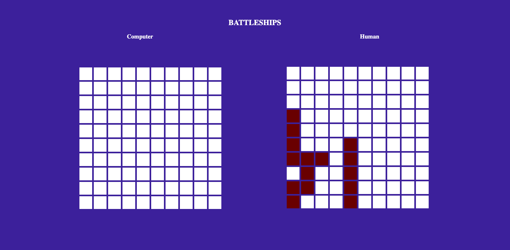

# Battleship-js

A browser based Battleship Game.

## Technologies
HTML

CSS

JavaScript

Jest

## Requirements

Nude

Browser

## Installation
> Open your git bash and **cd** to the location you'd like to put your files the run the command below.

`git@github.com:AdnanAfsari/Battleship-js.git`

**cd** to into the project folder and open the run- `npm install` then `npm run build` then `npm run server`and `npm test` to run the tests.

## Author
[James Okunlade](https://github.com/JamesOkunlade)

[Adnan Afsari](https://github.com/AdnanAfsari)
